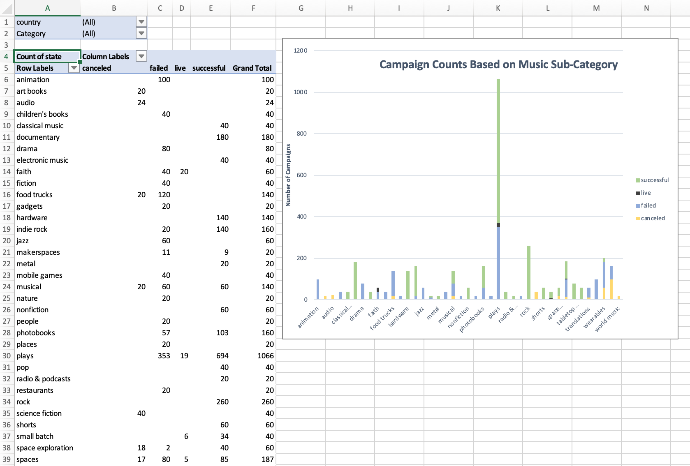
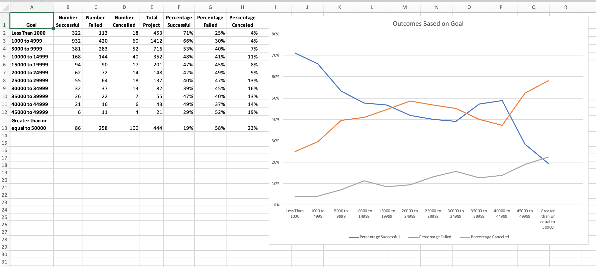
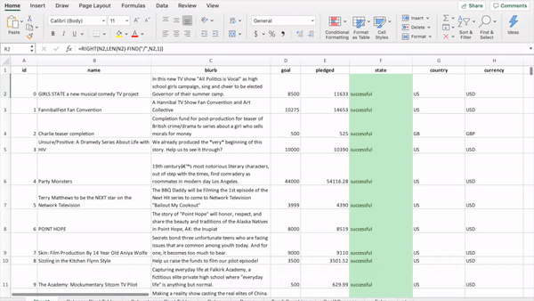

# Hidden Trends in Kickstarter Projects
###### Description:
Organized and analyzed a database of 4,000 past Kickstarter projects using conditional formatting, formulas and Excel pivot tables in order to uncover hidden market trends.

Kickstarter is a crowdfunding service where over 300,000 projects have been launched and over two billion dollars have been raised. Despite being a great platform that helps interesting ideas come to life, only 1/3 of the projects make it through the funding process with a positive outcome. Many organizations spend months looking through past projects in an attempt to discover tricks for finding success. In this Microsoft Excel based project, I organize and analyze past Kickstarter campaigns and create dynamic visualizations to show trends based on the category and sub-category of the campaigns, as well as country and goal amount. 

###### Tools used in this project:
- **Conditional formatting** was used to automatically change the fill colour of cells in a column based on the cell value.
- **Formulas** and conditional formatting were used to ** automatically create new columns** and colour them using a three-colour-scale.

                                                       
- Formulas were used to **split cells** into categories and sub-categories. 

- **Pivot tables** were used to count the number of successful, failed, canceled and live campaigns per category.
- A **stacked column pivot chart** that could be **filtered** by country was used to offer insights on the different categories and sub-categories in each country. 

- Formulas were used to convert timestamps into normal dates and Excel Date format.
- A **pivot chart line graph** was created to visualize the number of successful, failed and canceled campaigns filtered by category and year.

